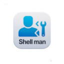
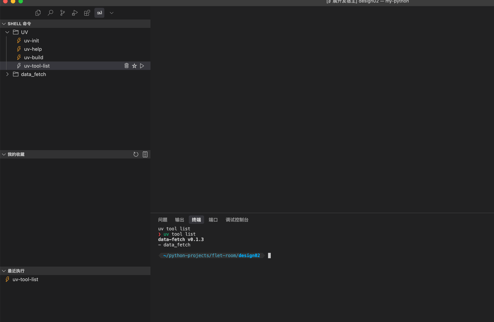

  

<h1 align="center">Shell Man</h1>

  <strong>一款在 VS Code 中管理和执行 Shell 命令的利器。</strong>

  
  
  

`Shell Man` 是一款 VS Code 扩展，旨在帮助开发者更方便地管理和组织常用的 Shell 命令和脚本。你可以用它来创建、编辑、删除、执行、收藏 Shell 命令，并将它们以树状结构清晰地展示出来。

## ✨ 功能特性

*   🗂️ **树状视图**：以树状结构组织您的 Shell 命令，支持文件夹嵌套。
*   ▶️ **一键执行**：在侧边栏中直接点击即可执行命令，无需切换到终端。
*   ⭐ **收藏夹**：收藏您最常用或最重要的命令，方便快速访问。
*   🕒 **最近执行**：自动记录最近执行过的命令。
*   ➕ **轻松管理**：通过图形化界面轻松添加、编辑和删除命令和文件夹。
*   ⚙️ **自定义**：灵活配置你的命令和脚本。

## 🚀 如何使用

1.  在 VS Code 的活动栏中找到 `Shell Man` 的图标，点击它。
2.  你会看到三个视图：
    *   **Shell 命令**：这里存放着你所有的 Shell 命令和脚本。
    *   **我的收藏**：你收藏的命令会在这里显示。
    *   **最近执行**：你最近运行过的命令会在这里显示。
3.  点击视图标题栏的 `+` 图标来添加一个新的命令或文件夹。
4.  在命令上右键单击，会弹出上下文菜单，你可以执行、收藏或删除它。

## 📖 命令列表

`Shell Man` 提供了丰富的命令来帮助你管理脚本：

*   `shell_man_common.settings`: 打开配置。
*   `shell_man_command.refresh`: 刷新命令列表。
*   `shell_man_command.add`: 新增命令或文件夹。
*   `shell_man_command.delete`: 删除选中的命令或文件夹。
*   `shell_man_common.execute`: 执行选中的命令。
*   `shell_man_favorite.add`: 将命令添加到收藏夹。
*   `shell_man_favorite.refresh`: 刷新收藏列表。
*   `shell_man_favorite.delete`: 从收藏夹中删除。
*   `shell_man_last_run.refresh`: 刷新最近执行列表。
*   `shell_man_last_run.delete`: 从最近执行列表中删除。

## 📜 许可证

本项目基于 [MIT](LICENSE) 许可证。
